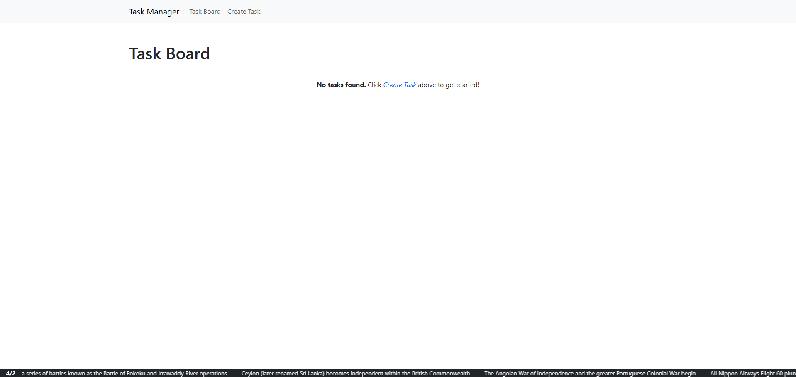
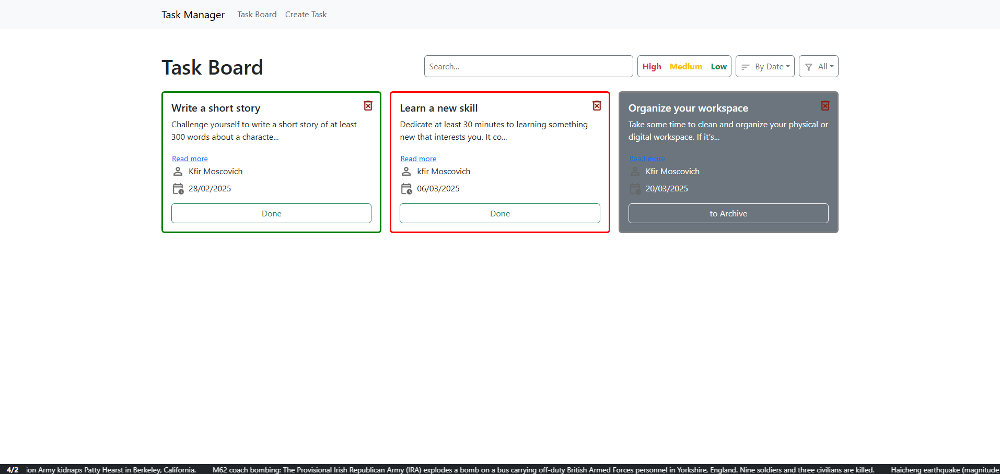
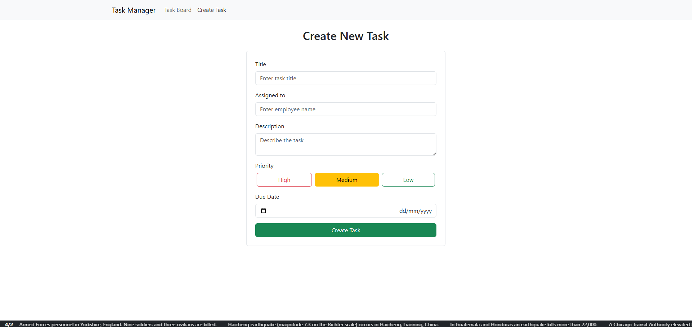
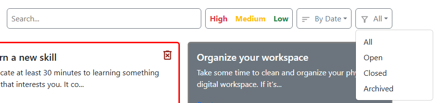
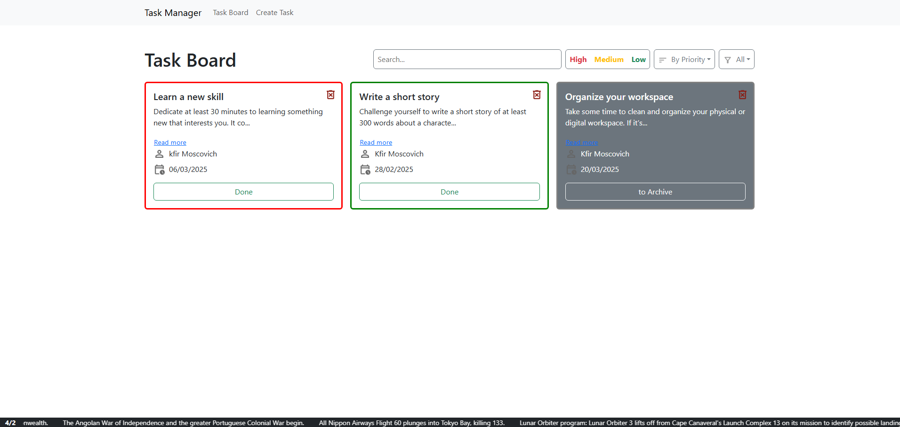

## כפיר מוסקוביץ | תיעוד פרויקט

## סקירה כללית של הפרויקט
פרויקט זה הוא אפליקציה לניהול משימות שנבנתה באמצעות React ו-TypeScript, תוך שימוש ב-Vite לביצועים מהירים. האפליקציה מאפשרת למשתמשים ליצור, לנהל ולסנן משימות בצורה קלה ואינטואיטיבית, תוך שימוש ב-Zustand לניהול נתונים.

## תכונות עיקריות
- **יצירת משימה**: משתמשים יכולים להוסיף משימות חדשות באמצעות טופס ייעודי.
- **סינון משימות**: תפריט נפתח שמאפשר לסנן משימות לפי סטטוס המשימה.
- **לוח משימות**: מציג את כל המשימות בצורה מאורגנת.
- **מחיקת משימה**: משתמשים יכולים למחוק משימות ישירות מהלוח.
- **עדכונים בזמן אמת**: האינטגרציה עם Zustand מבטיחה שכל הנתונים מסונכרנים.

## רכיבים ומהותם
### קבצים כלליים
- **`App.tsx`**: הרכיב הראשי שמחבר את כל שאר הרכיבים ומנהל את הניווט בין הדפים.
- **`main.tsx`**: נקודת הכניסה הראשית של האפליקציה שבה React מטעין את רכיב ה-`App`.

### רכיבים
- **`CreateTaskForm.tsx`**
  - רכיב טופס ליצירת משימות חדשות.
  - כולל שדות קלט לשם המשימה, תיאור ותאריך יעד.
  - פונקציות עיקריות:
    - `handleSubmit` - מטפלת בשליחת הטופס, שומרת את הנתונים בזיכרון הגלובלי.
    - `handleChange` - מעדכנת את ה-state עם הערכים שהמשתמש מכניס.
  - **Hooks בשימוש**: `useState` לניהול מצב הטופס.

- **`Controls.tsx`**
  - רכיב בקרה לסינון ומיון משימות.
  - מאפשר למשתמשים לסנן משימות לפי קריטריונים שונים.
  - פונקציות עיקריות:
    - `handleFilterChange` - משנה את הקריטריון לפיו מסננים את המשימות.
    - `handleSortChange` - משנה את הסדר שבו מוצגות המשימות.
  - **Hooks בשימוש**: `useState` לניהול ערכי הסינון והמיון.

- **`TaskBoard.tsx`**
  - מציג את כל המשימות בלוח.
  - משולב עם Zustand לשליפת נתונים ועדכון המשימות בזמן אמת.
  - פונקציות עיקריות:
    - `fetchTasks` - שולפת את כל המשימות ממצב הגלובלי.
    - `deleteTask` - מוחקת משימה ספציפית.
    - `markAsDone` - מסמנת משימה כהושלמה.
    - `archiveTask` - מעבירה משימה לארכיון.
  - **Hooks בשימוש**: `useEffect` לטעינת נתונים, `useState` לניהול המשימות.

- **`History.tsx`**
  - רכיב להצגת היסטוריית משימות ואירועים.
  - מאפשר למשתמשים לצפות בפעולות שבוצעו בעבר.
  - פונקציות עיקריות:
    - `fetchHistory` - שולפת את היסטוריית המשימות מהמצב הגלובלי.
    - `renderHistoryItem` - מציגה פריט בודד בהיסטוריה בצורה ברורה.
  - **Hooks בשימוש**: `useEffect` לטעינת נתונים, `useState` לניהול ההיסטוריה.

## טכנולוגיות בשימוש
- **React**: לבניית ממשק המשתמש.
- **TypeScript**: מוסיף טיפוסים ומבנה קוד ברור.
- **Vite**: כלי פיתוח מהיר ויעיל.
- **Zustand**: לניהול נתונים גלובלי.
- **CSS**: לעיצוב הרכיבים.
- **React Router**: לניווט בין דפים.

## התקנות בפרויקט
- **bootstrap**: לעיצוב ממשק המשתמש.
- **vite**: סביבה מהירה לפיתוח.
- **react**: ספריית React לבניית הממשק.
- **zustand**: לניהול State פשוט ויעיל.
- **typescript**: לעבודה עם טיפוסים.
- **react-router-dom**: לניווט בין דפים באפליקציה.

## איך להריץ את הפרויקט
1. להריץ `npm install` כדי להתקין את כל התלויות.
2. להפעיל את האפליקציה עם `npm run dev`.
3. לפתוח את `http://localhost:5173` בדפדפן.

---

## תמונות

